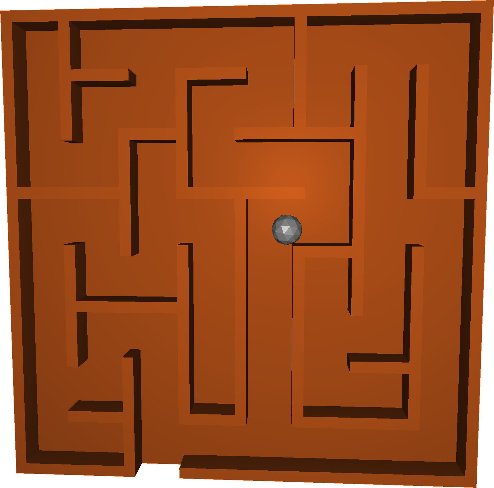

# HapticBallLabyrinth

This virtual labyrinth is controlled with two Hapkits

## User Manual

### Building and running

    $ cd BallLabyrinth
    $ mkdir build
    $ cd ./build/
    $ cmake ..
    $ make
    $ cd ..
    $ ./build/BallLabyrinth arg1 arg2

In our case

    $ ./build/BallLabyrinth /dev/ttyUSB0 /dev/ttyUSB1

The executable needs the file descriptors of the serial interface of the Hapkits as the first and second argument.

### Keybindings

Each of the haptic feebacks can be toggled to provide different user experiences.

The follwing key bindings are used to toggle haptic feedback

* **s** -- Center Spring
* **w** -- Virtual Wall
* **c** -- Ball Collision
* **q** -- Quits the program

### Dependencies 

- OpenGl
- Glew
- SDL2
- SDL2_image
- Boost
