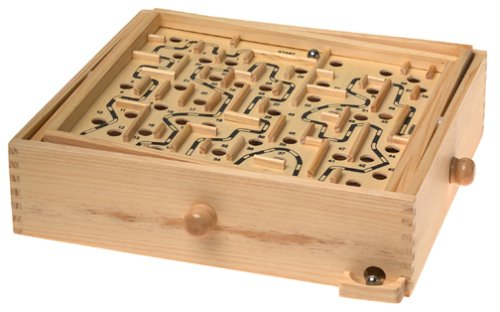
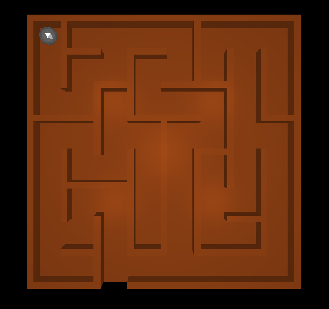

# Final project proposal
### Philipp Mildenberger, Philipp Pobitzer

## Labyrinth

{#fig:woodenLabyrinth width=40%}

Labyrinth is a classical game consisting of a box with a maze on top with holes, and a marble. The object of the game is to try to adjust the play-field to guide the marble out of the maze, without letting it fall into any of the holes, if there are any. It is controlled via two knobs. These knobs control a rotation along the two degrees of freedom the suspended maze has. A wooden version can be seen in the figure above.

## Overview

{#fig:ballMaze width=40%}

Our colleague Stefan Spiss has implemented a labyrinth as the final project in physically based simulation. A screenshot of this can be seen in figure \ref{fig:ballMaze}. We want to augment this program with the possibility to use two Hapkit as means to control the game. Each Hapkit models one knob and therefore controls one of the two degrees of freedom the maze has.

To model haptic feedback we have some ideas, a simple one would be to model limited degree of freedom of the knobs with a virtual
wall (or the hard surface implementation), another idea is to give a force feedback for the rolling of the marble, based
on the velocity (maybe a texture similar to the steam controllers). If the marble hits the wall, we could give force
feeback for the collision (hard surface implementation would be the most straight-forward approach for this)
