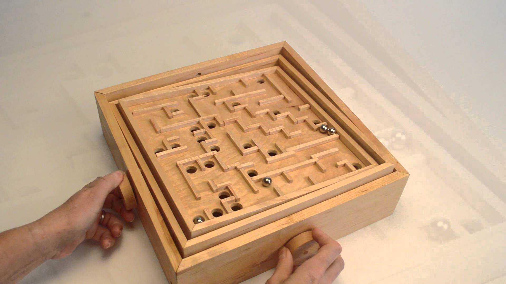

---
header-includes:
  - \usepackage{subcaption}
---

# Haptic Labyrinth -- Final Project
### Philipp Mildenberger, Philipp Pobitzer

## Labyrinth

{#fig:lab width=100%}

Labyrinth is a classical game consisting of a box with a maze on top with holes, and a marble. The object of the game is to try to adjust the play-field to guide the marble out of the maze, without letting it fall into any of the holes, if there are any. It is controlled via two knobs. These knobs control a rotation along the two degrees of freedom the suspended maze has. A wooden version can be seen in Figure \ref{fig:lab}.

## Overview

\begin{figure}[h!]
    \begin{subfigure}{0.5\textwidth}
        \centering
        \includegraphics[width=0.8\textwidth]{./labyrinthRender.png}
        \caption*{Render of the application}
    \end{subfigure}%
    \begin{subfigure}{0.5\textwidth}
        \centering
        \includegraphics[width=0.8\textwidth]{./hapkitHandles.jpg}
        \caption*{Haptic input controllers}
    \end{subfigure}
    \caption{Application in action}
    \label{fig:app}
\end{figure}

Our colleague Stefan Spiss has implemented a labyrinth as the final project in physically based simulation. A screenshot of the application in action can be seen in Figure \ref{fig:app}.
We augmented this application with the possibility to use two Hapkits to control the game.
Each Hapkit models one knob and therefore controls one of the two degrees of freedom the maze has.

The implementation contains 3 different haptic feedbacks, which are explained in more detail in the following sections

### Virtual Wall

For each handle virtual walls limit the moving range of the handle.
A simulated spring pulls back the handles into defined range, using the following formula, which is applied to each wall, if the predefined range is exceeded:
$$
force = -k_{wall}\cdot(pos_{handle}-x_{wall})
$$

### Center Spring

Additionally we implemented a mode, that pulls the handles back to the neutral position, using a simple spring:
$$
force = -k \cdot x_{handle}
$$

### Ball Collision

To simulate the impulses of the ball-wall collision, we implemented a force feedback for each collision, based on the
strength of the impulse.
The force is applied for a short period of time, which is fixed (~20 ms).

The force for the impulse is calculated using the following formula

$$
force = -impulse \cdot velocity
$$

The forces are split for each axis ($x, y$), and mapped to the corresponding handle

## User Manual

The executable needs the adresses of the Hapkits as the first and second argument.

Each of the haptic feebacks can be toggled to provide different user experiences.

The follwing key bindings are used to toggle haptic feedback

* **s** -- Center Spring
* **w** -- Virtual Wall
* **c** -- Ball Collision
