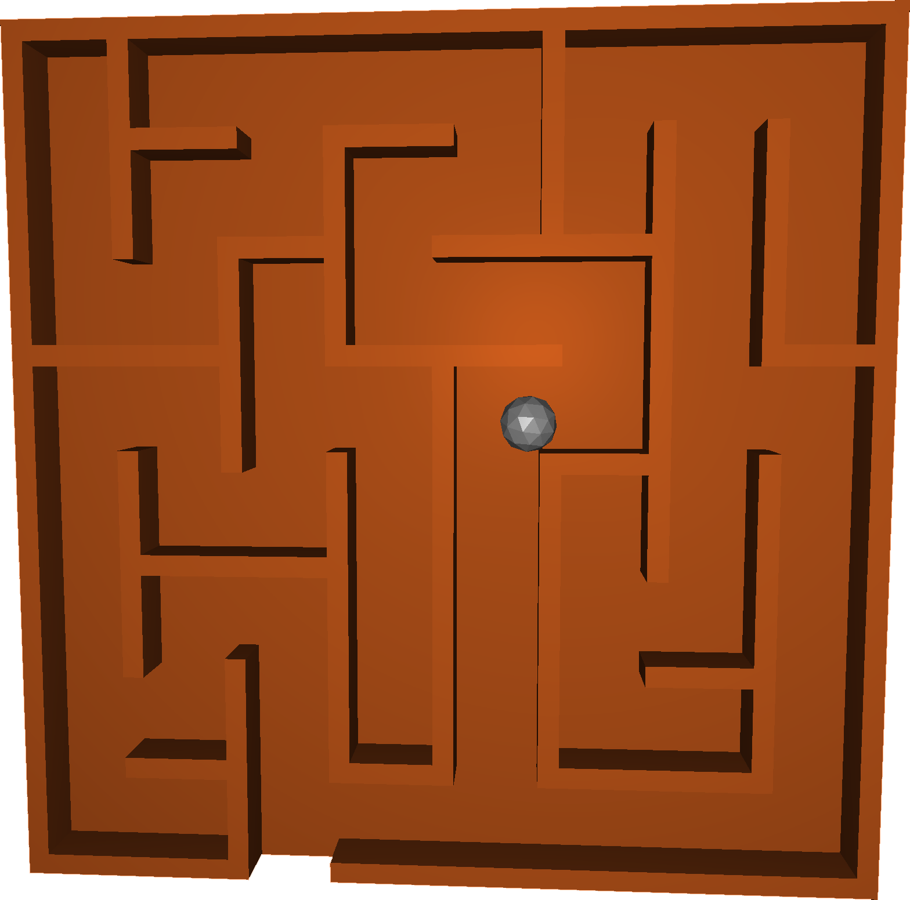

% Haptic Labyrinth
% Philipp Mildenberger, Philipp Pobitzer
% \today

# Motivation

{width=100%}

# How it looks in Action

{#fig:labRend height=49%}
{#fig:lab height=49%}

* Three different haptic feedbacks
    * Ball collision with wall
    * Spring that throws the handles back to center
    * Wall that limits the moving range of the handles
* All modes are opitional (can be )
